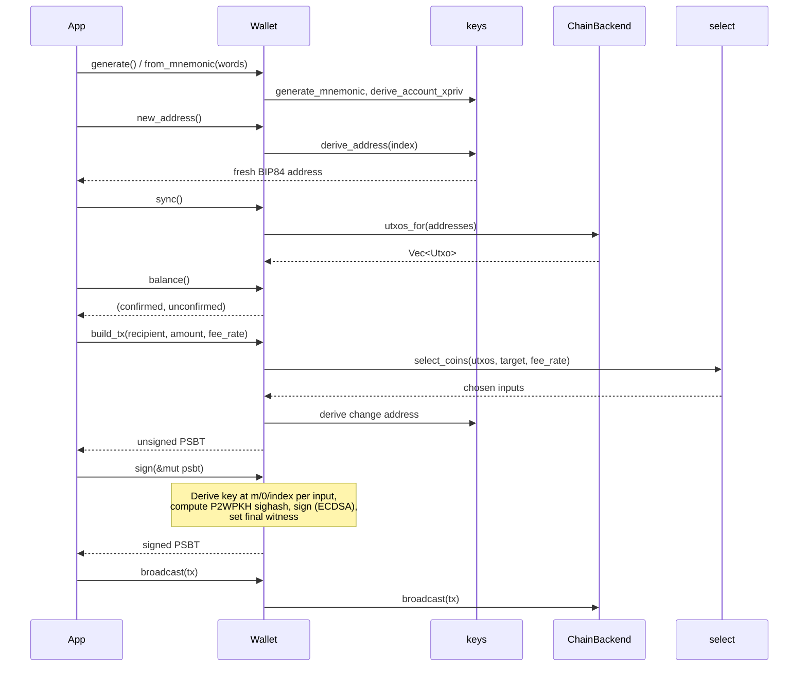

# wallet_lib Architecture

`wallet_lib` is a small Bitcoin wallet library using BIP84 (native SegWit, P2WPKH) addresses. `Wallet<B>` is generic over a `ChainBackend`, so chain access can be swapped out.

## Module Responsibilities

| Module | Responsibility |
|---|---|
| `wallet.rs` | Public entry point. Holds the account key, network, derived addresses, synced UTXOs and the backend. Orchestrates the other modules. |
| `keys.rs` | Mnemonic generation, BIP39 seed to BIP84 account `Xpriv`, and receive address derivation. |
| `select.rs` | Coin selection for a target amount and fee rate, using `bdk_coin_select`. |
| `backend.rs` | The `ChainBackend` trait, the `Utxo` type, and `FakeBackend`, an in-memory implementation for tests. |
| `error.rs` | A single `Error` enum and `Result` alias shared by all modules. |

## Transaction Lifecycle

## Key Design Points

- **Pluggable chain access.** `Wallet<B: ChainBackend>` depends only on the trait. Consumers can implement it for Electrum, Esplora or Bitcoin Core RPC, and tests use `FakeBackend`.
- **Single signer.** `sign` fills in each input's final witness directly, so the result is broadcastable without a separate finalize step.
- **No address reuse.** `new_address` increments an index on every call, and change goes to a fresh address.
- **Explicit sync.** UTXOs and balances reflect the last `sync()` call. The wallet never polls the chain on its own.
- **Unified errors.** Errors from `bip39`, `miniscript` and `bip32` convert into `Error` through `#[from]`.
- **Re-exports.** `bitcoin`, `bip39` and `miniscript` are re-exported from `lib.rs`, so consumers use matching versions.

## Tests

Integration tests live in `test/` (declared explicitly in `Cargo.toml`): `keysT`, `selectT`, `backendT`, `walletT`. Each targets the module it is named after.
